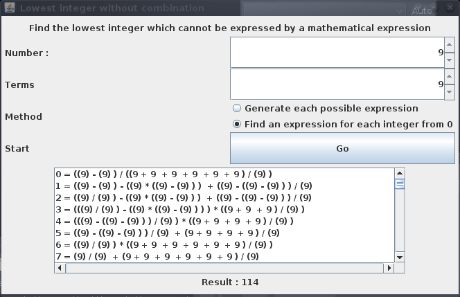

# Inexpressible

[]

Which sum cannot be expressed with x terms of value 'y' ?

Output sent with `App FindByStrategies 9 9`

```
0 = ((9) - (9) ) / ((9 + 9  + 9  + 9  + 9  + 9 ) / (9) ) 
1 = ((9) - (9) ) - ((9) * ((9) - (9) ) )  + ((9) - ((9) - (9) ) ) / (9)  
2 = ((9) / (9) ) - ((9) * ((9) - (9) ) )  + ((9) - ((9) - (9) ) ) / (9)  
3 = (((9) / (9) ) - ((9) * ((9) - (9) ) ) ) * ((9 + 9  + 9 ) / (9) ) 
4 = (((9) - ((9) - (9) ) ) / (9) ) * ((9 + 9  + 9  + 9 ) / (9) ) 
5 = ((9) - ((9) - (9) ) ) / (9)  + (9 + 9  + 9  + 9 ) / (9)  
6 = ((9) / (9) ) * ((9 + 9  + 9  + 9  + 9  + 9 ) / (9) ) 
7 = (9) / (9)  + (9 + 9  + 9  + 9  + 9  + 9 ) / (9)  
8 = (9 + 9  + 9  + 9  + 9  + 9  + 9  + 9 ) / (9) 
9 = ((9) / ((9 + 9  + 9 ) / (9) ) ) * ((9 + 9  + 9 ) / (9) ) 
10 = ((9 + 9 ) / (9) ) * ((9 + 9  + 9  + 9  + 9 ) / (9) ) 
11 = (9) / (9)  + ((9) - ((9) - (9) ) ) / (9)   + (9) - ((9) - (9) )  
12 = ((9 + 9  + 9 ) / (9) ) * ((9 + 9  + 9  + 9 ) / (9) ) 
13 = (9) / (9)  + (9 + 9  + 9 ) / (9)   + (9) - ((9) - (9) )  
14 = (9 + 9  + 9  + 9  + 9 ) / (9)  + (9) - ((9) - (9) )  
15 = ((9 + (9) * (9)  ) / (9 + 9 ) ) * ((9 + 9  + 9 ) / (9) ) 
16 = (- ((9 + 9 ) / (9) ) ) - (((9) * (9) ) * ((9) - (9) ) )  + 9 + 9  
17 = (- ((9) * ((9) - (9) ) ) ) - (((9) - ((9) - (9) ) ) / (9) )  + 9 + 9  
18 = ((9) / (9)  + ((9) - ((9) - (9) ) ) / (9)  ) * ((9) - ((9) - (9) ) ) 
19 = - ((9) * ((9) - (9) ) )  + ((9) - ((9) - (9) ) ) / (9)   + 9 + 9  
20 = ((9 + 9 ) / (9) ) - (((9) * (9) ) * ((9) - (9) ) )  + 9 + 9  
21 = (9 + 9 ) / (9)  + ((9) - ((9) - (9) ) ) / (9)   + 9 + 9  
22 = ((9) / (9) ) * ((9 + 9  + 9  + 9 ) / (9) )  + 9 + 9  
23 = (9) / (9)  + (9 + 9  + 9  + 9 ) / (9)   + 9 + 9  
24 = (9 + 9  + 9  + 9  + 9  + 9 ) / (9)  + 9 + 9  
25 = (- ((9) / (9) ) ) - (((9) - ((9) - (9) ) ) / (9) )  + 9  + 9 + 9  
26 = - (((9) - ((9) - (9) ) ) / (9) )  + (9) - ((9) - (9) )   + 9 + 9  
27 = (((9) / (9) ) * ((9 + 9  + 9 ) / (9) ) ) * ((9) - ((9) - (9) ) ) 
28 = (- ((9 + 9 ) / (9) )  + 9 ) * ((9 + 9  + 9  + 9 ) / (9) ) 
29 = (9) / (9)  + ((9) - ((9) - (9) ) ) / (9)   + 9  + 9 + 9  
30 = ((9) / (9)  + (9) - ((9) - (9) )  ) * ((9 + 9  + 9 ) / (9) ) 
31 = ((- (9) ) - ((9) * (9) ) ) / (9 + 9 )  + 9 + 9   + 9 + 9  
32 = ((- (9)  + (9) * (9)  ) / (9) ) * ((9 + 9  + 9  + 9 ) / (9) ) 
33 = ((9) / (9)  + 9  + (9) / (9)  ) * ((9 + 9  + 9 ) / (9) ) 
34 = (- ((9 + 9 ) / (9) ) ) - ((9) - (9) )  + 9 + 9   + 9 + 9  
35 = (- ((9) / (9) ) ) - ((9) * ((9) - (9) ) )  + 9 + 9   + 9 + 9  
36 = ((9) / (9)  + (9 + 9  + 9 ) / (9)  ) * ((9) - ((9) - (9) ) ) 
37 = ((9) / (9) ) - ((9) * ((9) - (9) ) )  + 9 + 9   + 9 + 9  
38 = (((9) - ((9) - (9) ) ) / (9)  + 9 + 9  ) * ((9 + 9 ) / (9) ) 
39 = (9) / ((9 + 9  + 9 ) / (9) )  + 9 + 9   + 9 + 9  
40 = (- ((9) / (9) )  + 9 ) * ((9 + 9  + 9  + 9  + 9 ) / (9) ) 
41 = (9 + (9) * (9)  ) / (9 + 9 )  + 9 + 9   + 9 + 9  
42 = ((9 + 9  + 9 ) / (9)  + 9 + 9  ) * ((9 + 9 ) / (9) ) 
43 = (- ((9) / (9) )  + 9 ) - ((9) / (9) )  + 9 + 9   + 9 + 9  
44 = ((9 + 9 ) / (9)  + 9 ) * ((9 + 9  + 9  + 9 ) / (9) ) 
45 = ((9 + 9  + 9  + 9  + 9 ) / (9) ) * ((9) - ((9) - (9) ) ) 
46 = (9) / (9)  + (9) - ((9) - (9) )   + 9 + 9   + 9 + 9  
47 = (9) / (9)  + 9  + (9) / (9)   + 9 + 9   + 9 + 9  
48 = (- ((9 + 9 ) / (9) )  + 9 + 9  ) * ((9 + 9  + 9 ) / (9) ) 
49 = ((((9) * ((9) * (9) ) ) - (9) ) / (9 + 9 ) ) - (9)  + 9 + 9  
50 = ((9) / (9)  + 9 ) * ((9 + 9  + 9  + 9  + 9 ) / (9) ) 
51 = ((- (9)  + (9) * (9)  ) / (9)  + 9 ) * ((9 + 9  + 9 ) / (9) ) 
52 = ((- (9)  + (9) * (9)  ) / (9)  + 9 + 9  ) * ((9 + 9 ) / (9) ) 
53 = ((- ((9) / (9) ) ) - ((9) - ((9) - (9) ) ) ) - (9 + 9 )  + (9) * (9)  
54 = ((9 + 9 ) / (9)  + ((9) - ((9) - (9) ) ) / (9)  ) * (9 + 9 ) 
55 = (((9) / (9) ) - ((9) - ((9) - (9) ) ) ) - (9 + 9 )  + (9) * (9)  
56 = (((9) / (9) ) - (9)  + (9) / (9)  ) - (9 + 9 )  + (9) * (9)  
57 = ((9 + (9) * (9)  ) / (9)  + 9 ) * ((9 + 9  + 9 ) / (9) ) 
58 = (((- (9) ) - ((9) * (9) ) ) / (9 + 9 ) ) - (9 + 9 )  + (9) * (9)  
59 = (- ((9 + 9  + 9  + 9 ) / (9) ) ) - (9 + 9 )  + (9) * (9)  
60 = ((9 + 9 ) / (9)  + 9 + 9  ) * ((9 + 9  + 9 ) / (9) ) 
61 = (((- (9) ) - ((9) * (9) ) ) / (9) ) * ((9 + 9 ) / (9) )  + (9) * (9)  
62 = ((- ((9) / (9) ) ) - ((9) * ((9) - (9) ) ) ) - (9 + 9 )  + (9) * (9)  
63 = (9) * ((9 + 9  + 9  + 9  + 9  + 9  + 9 ) / (9) ) 
64 = (((9) / (9) ) - ((9) * ((9) - (9) ) ) ) - (9 + 9 )  + (9) * (9)  
65 = (((9 + 9 ) / (9) ) - ((9) - (9) ) ) - (9 + 9 )  + (9) * (9)  
66 = (((9) / ((9 + 9  + 9 ) / (9) ) ) - (9) ) - (9)  + (9) * (9)  
67 = (- ((9 + 9  + 9  + 9  + 9 ) / (9) ) ) - (9)  + (9) * (9)  
68 = ((9 + (9) * (9)  ) / (9 + 9 ) ) - (9 + 9 )  + (9) * (9)  
69 = (- ((9 + 9  + 9 ) / (9) ) ) - ((9) - ((9) - (9) ) )  + (9) * (9)  
70 = ((- ((9) / (9) ) ) - (((9) - ((9) - (9) ) ) / (9) ) ) - (9)  + (9) * (9)  
71 = (- (((9) - ((9) - (9) ) ) / (9) ) ) - ((9) - ((9) - (9) ) )  + (9) * (9)  
72 = (((9) / (9) ) * ((9 + 9  + 9  + 9 ) / (9) ) ) * (9 + 9 ) 
73 = (((9) - ((9) - (9) ) ) / (9) ) - ((9) - ((9) - (9) ) )  + (9) * (9)  
74 = ((9) / (9)  + ((9) - ((9) - (9) ) ) / (9)  ) - (9)  + (9) * (9)  
75 = - ((9 + 9  + 9  + 9  + 9  + 9 ) / (9) )  + (9) * (9)  
76 = (- ((9) / (9) ) ) - ((9 + 9  + 9  + 9 ) / (9) )  + (9) * (9)  
77 = (- ((9) / (9) ) ) * ((9 + 9  + 9  + 9 ) / (9) )  + (9) * (9)  
78 = (- ((9 + 9 ) / (9) ) ) - (((9) - ((9) - (9) ) ) / (9) )  + (9) * (9)  
79 = (- ((9 + 9 ) / (9) ) ) - (((9) * (9) ) * ((9) - (9) ) )  + (9) * (9)  
80 = (- ((9) * ((9) - (9) ) ) ) - (((9) - ((9) - (9) ) ) / (9) )  + (9) * (9)  
81 = ((9) - (9) ) / ((9 + 9  + 9  + 9 ) / (9) )  + (9) * (9)  
82 = - ((9) * ((9) - (9) ) )  + ((9) - ((9) - (9) ) ) / (9)   + (9) * (9)  
83 = ((9 + 9 ) / (9) ) - (((9) * (9) ) * ((9) - (9) ) )  + (9) * (9)  
84 = (9 + 9 ) / (9)  + ((9) - ((9) - (9) ) ) / (9)   + (9) * (9)  
85 = ((9) / (9) ) * ((9 + 9  + 9  + 9 ) / (9) )  + (9) * (9)  
86 = (9) / (9)  + (9 + 9  + 9  + 9 ) / (9)   + (9) * (9)  
87 = (9 + 9  + 9  + 9  + 9  + 9 ) / (9)  + (9) * (9)  
88 = (- ((9) / (9) ) ) - (((9) - ((9) - (9) ) ) / (9) )  + 9  + (9) * (9)  
89 = - (((9) - ((9) - (9) ) ) / (9) )  + (9) - ((9) - (9) )   + (9) * (9)  
90 = ((9) / (9)  + (9 + 9  + 9  + 9 ) / (9)  ) * (9 + 9 ) 
91 = ((9) - ((9) - (9) ) ) / (9)  + (9) - ((9) - (9) )   + (9) * (9)  
92 = (9) / (9)  + ((9) - ((9) - (9) ) ) / (9)   + 9  + (9) * (9)  
93 = (9 + 9  + 9 ) / (9)  + (9) - ((9) - (9) )   + (9) * (9)  
94 = ((- (9) ) - ((9) * (9) ) ) / (9 + 9 )  + 9 + 9   + (9) * (9)  
95 = (9 + 9  + 9  + 9  + 9 ) / (9)  + 9  + (9) * (9)  
96 = (- (9) ) / ((9 + 9  + 9 ) / (9) )  + 9  + 9  + (9) * (9)  
97 = (- ((9 + 9 ) / (9) ) ) - ((9) - (9) )  + 9 + 9   + (9) * (9)  
98 = (- ((9) / (9) ) ) - ((9) * ((9) - (9) ) )  + 9 + 9   + (9) * (9)  
99 = ((9 + 9 ) / (9)  + (9) - ((9) - (9) )  ) * ((9) - ((9) - (9) ) ) 
100 = ((9) / (9) ) - ((9) * ((9) - (9) ) )  + 9 + 9   + (9) * (9)  
101 = ((9 + (9) * (9)  ) / (9) ) * ((9 + 9 ) / (9) )  + (9) * (9)  
102 = (9) / ((9 + 9  + 9 ) / (9) )  + 9 + 9   + (9) * (9)  
103 = (9 + 9  + 9  + 9 ) / (9)  + 9 + 9   + (9) * (9)  
104 = (9 + (9) * (9)  ) / (9 + 9 )  + 9 + 9   + (9) * (9)  
105 = - ((9 + 9  + 9 ) / (9) )  + 9  + 9 + 9   + (9) * (9)  
106 = (- ((9) / (9) )  + 9 ) - ((9) / (9) )  + 9 + 9   + (9) * (9)  
107 = - ((9) / (9) )  + (9) - ((9) - (9) )   + 9 + 9   + (9) * (9)  
108 = ((9 + 9  + 9  + 9  + 9  + 9 ) / (9) ) * (9 + 9 ) 
109 = (9) / (9)  + (9) - ((9) - (9) )   + 9 + 9   + (9) * (9)  
110 = (9) / (9)  + 9  + (9) / (9)   + 9 + 9   + (9) * (9)  
111 = ((9) / (9)  + 9 ) * ((9 + 9  + 9 ) / (9) )  + (9) * (9)  
112 = ((((9) * ((9) * (9) ) ) - (9) ) / (9 + 9 ) ) - (9)  + (9) * (9)  
113 = (((9) * ((9) * (9) )  + 9 ) / (9 + 9 ) ) - (9)  + (9) * (9)  
Result : 114
```
